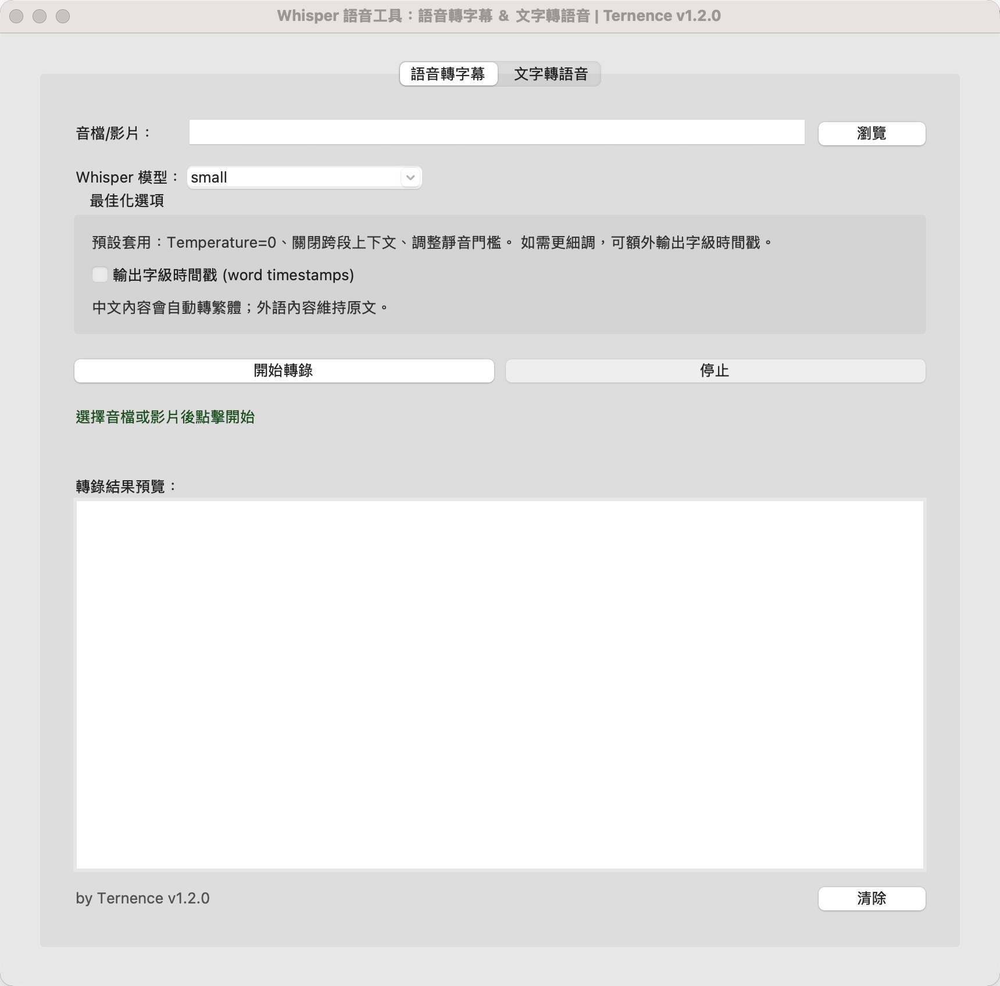
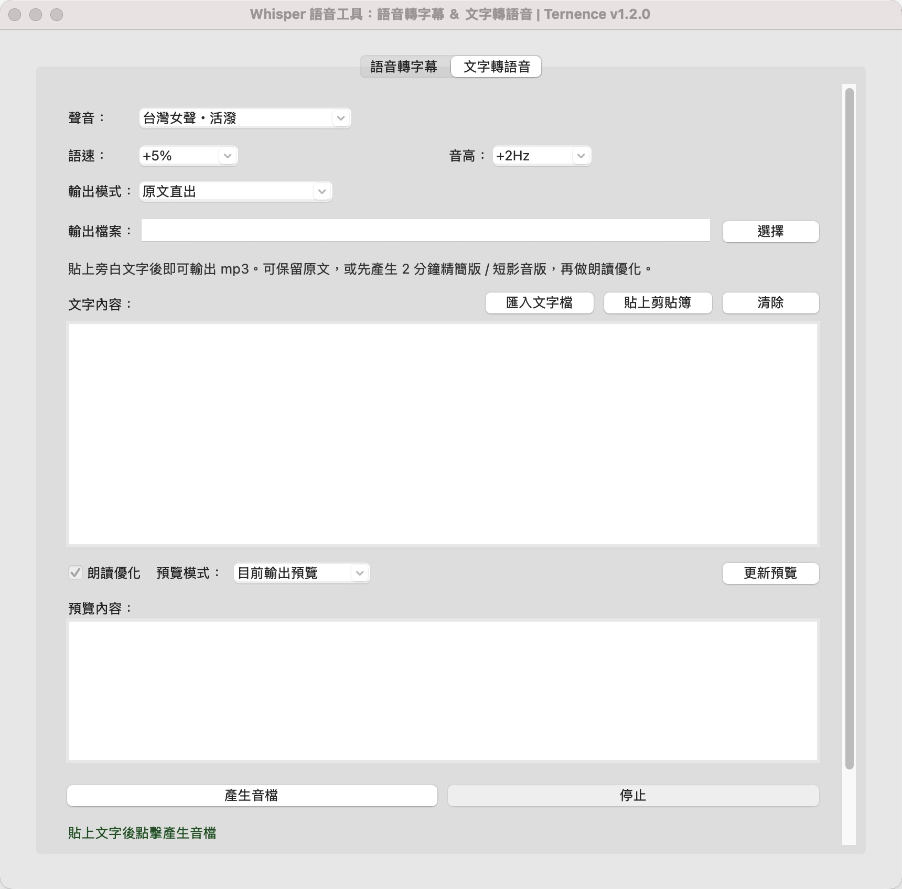

# Whisper 語音工具

本地執行的語音工具，附圖形介面，小白也能輕鬆使用。
作者：Ternence｜版本：v1.2.0

---

## 下載

| 平台 | 下載連結 |
|------|---------|
| **Mac** | [**下載 Mac 版 →**](https://github.com/ternence503/whisper-gui/releases/latest/download/Whisper_Mac_一鍵安裝版_v1.2.0.zip) |
| **Windows** | [**下載 Windows 版 →**](https://github.com/ternence503/whisper-gui/releases/latest/download/Whisper_Windows_一鍵安裝版_v1.2.0.zip) |

> 下載後解壓縮，雙擊「▶ 啟動 Whisper」即可。第一次會自動安裝環境（需連網），之後直接開啟。

---

## 功能

### 語音轉字幕（完全離線）
- 支援 mp3、wav、m4a、aac、flac、mp4、mov、mkv 等常見格式
- 自動偵測語言；中文內容自動轉為繁體
- 輸出 `.txt`、`.srt`、`.vtt` 三種格式
- 純 CPU 執行，不需 GPU
- 模型下載一次後，之後不需網路

### 文字轉語音（需網路）
- 12 種聲音，分為三組：
  - **台灣腔**：活潑、清亮、沉穩（男）
  - **粵語腔**：活潑、溫柔（女）、友善（男）
  - **普通話**：活潑、溫柔（女）、熱情、陽光、穩重、可愛（男）
- 語速 / 音高可調
- 輸出模式：原文直出、2 分鐘精簡版、短影音版
- 朗讀優化：時間、電話、網址自動轉為口語形式
- 輸出 `.mp3`，長文自動分段合成後合併

---

## 介面截圖

### 語音轉字幕

### 文字轉語音

---

## 安裝說明

### Mac 使用者

1. 下載並解壓縮 Mac 版 zip
2. 雙擊 `▶ 啟動 Whisper.command`
3. 第一次會自動安裝環境並下載模型（需連網，約需幾分鐘）
4. 之後一樣雙擊 `▶ 啟動 Whisper.command` 即可直接開啟

> macOS 可能提示「不明開發者」，請至「系統設定 → 隱私權與安全性 → 允許執行」

### Windows 使用者

1. 下載並解壓縮 Windows 版 zip
2. 雙擊 `▶ 啟動 Whisper.bat`
3. 第一次會自動安裝環境並下載模型（需連網，約需幾分鐘）
4. 之後一樣雙擊 `▶ 啟動 Whisper.bat` 或桌面捷徑即可直接開啟

---

## 更新

重新下載最新版 zip，雙擊啟動，程式會自動偵測並更新，不需手動操作。

---

## Whisper 模型說明

| 模型 | 大小 | 速度 | 精度 |
|------|------|------|------|
| base | ~150 MB | 最快 | 較低 |
| small | ~490 MB | 快（預設）| 中 |
| medium | ~1.5 GB | 中 | 高 |
| large | ~3 GB | 慢 | 最高 |
| turbo | ~1.6 GB | 快 | 接近 large |

---

## 系統需求

**Mac**
- macOS 12 以上
- 第一次安裝需連網

**Windows**
- Windows 10 以上（不支援 Windows 7 / 8 / 8.1）
- 第一次安裝需連網

---

## 版本紀錄

### v1.2.0（2026-03-26）
- 單一啟動按鈕（▶ 啟動 Whisper），首次安裝與之後啟動都用同一個
- 重新下載不重裝：環境存於本機固定位置，下載新版 zip 自動偵測版本更新
- Windows 安裝完成後自動在桌面建立捷徑
- 語速選項擴充至 +100%；音高選項擴充至 +10Hz
- Mac 修正 tkinter 未啟用問題
- Windows 修正非 UTF-8 系統啟動亂碼問題
- 修正 TTS 分頁 Cmd+V / Ctrl+V 貼上無反應

### v1.1.0
- 新增文字轉語音功能（TTS）
- 新增 12 種聲音、朗讀優化、精簡模式
- 新增語速 / 音高調整
